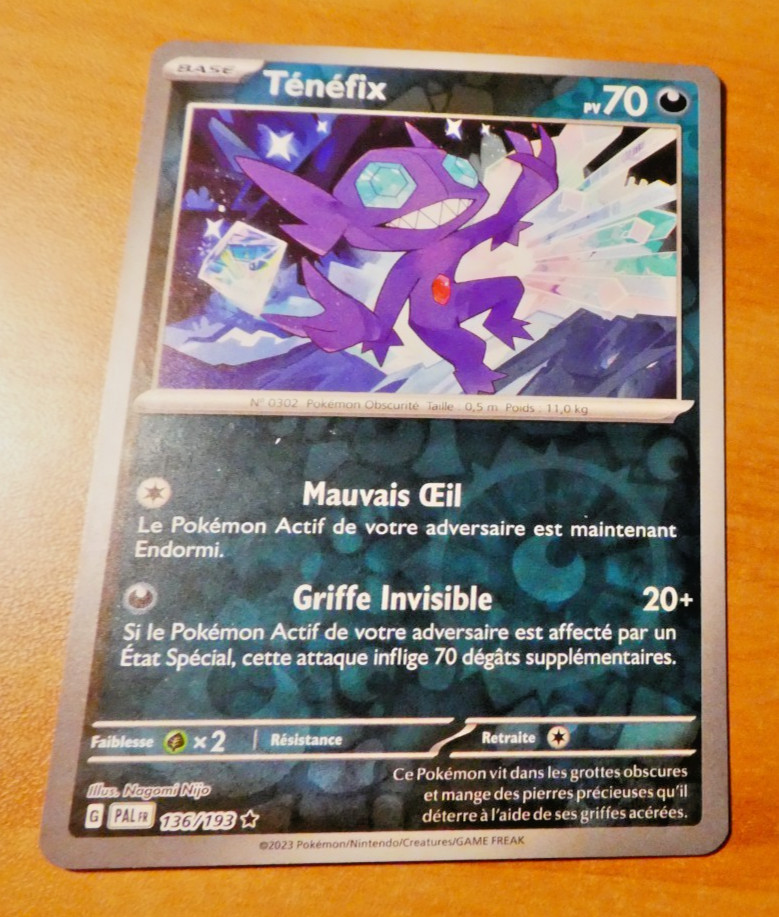
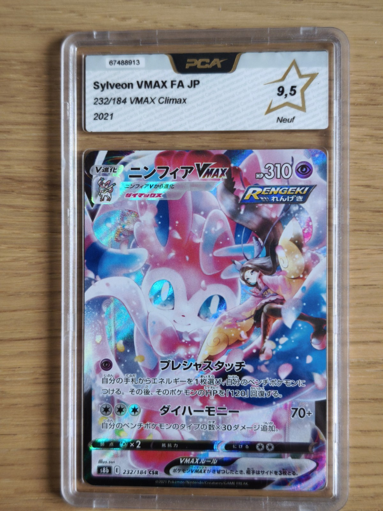
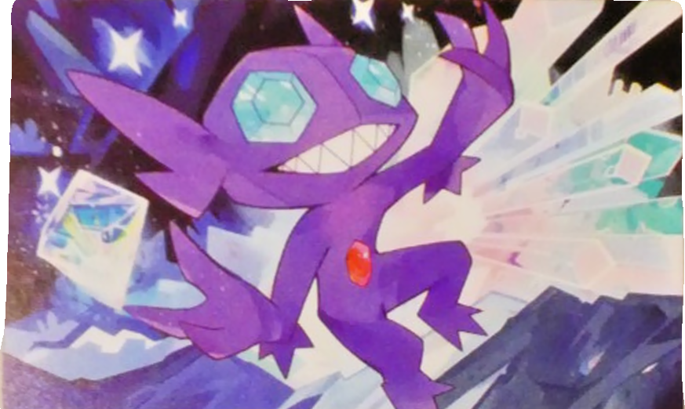
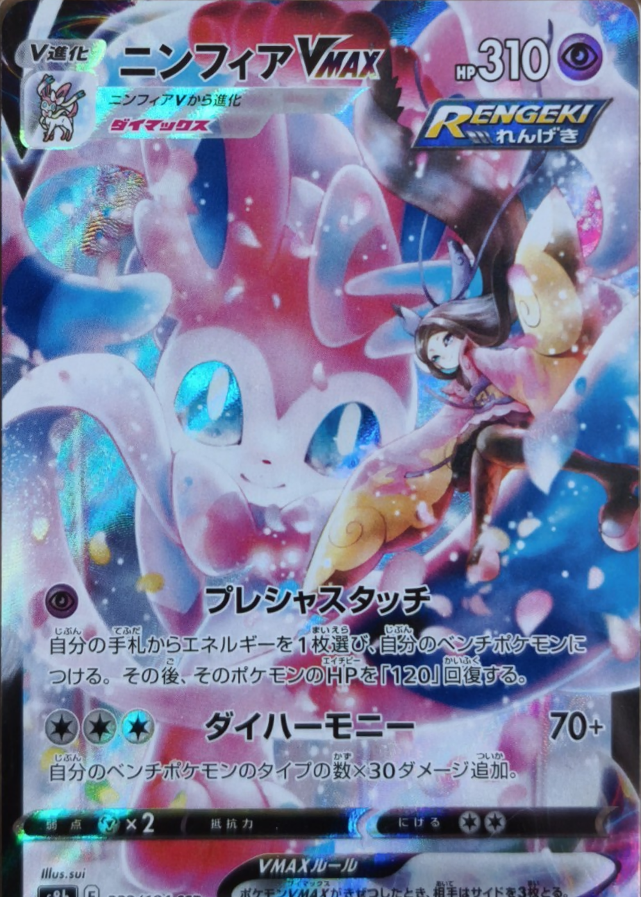

# Pokémon TCG Illustration Segmentation

An end-to-end Python pipeline that processes photographs of Pokémon Trading Card Game cards, rectifies each card, classifies its artwork layout, and extracts windowed illustrations with transparency.

## Pipeline

The complete workflow is executed by `run_pipeline.py`:

1. **Pre-processing** (`pre-proc.py`) applies EXIF orientation handling, conservative denoising, and optional white-balance or illumination correction.
2. **Card localization** (`card_segmentation_yolo_obb.py`) uses a YOLO oriented-bounding-box (YOLO-OBB) model to detect each card and produce a padded crop.
3. **Geometric refinement** (`refine_segmentation_yolo.py`) refines the detected edges with RANSAC and rectifies the card through a homography.
4. **Artwork classification and extraction** (`classify_and_extract_illustrations.py`) uses a YOLO classification model to distinguish `arte_completo` (full-art) from `arte_ventana` (windowed-art) cards. Windowed cards are then processed by a YOLO segmentation model; the predicted illustration mask is saved as an RGBA PNG.

The default flow is:

```text
img -> img_pre -> img_segm_yolo -> img_refined -> img_clasif
```

Each stage has a distinct role in turning a casual card photograph into a
usable illustration asset:

1. The input photograph is normalized while preserving its original visual
   content.
2. YOLO-OBB finds the card even when it is rotated or photographed at an
   angle, then produces a padded card crop.
3. RANSAC refines the four card edges and a perspective transform rectifies
   the crop into a front-facing card image.
4. The artwork-layout classifier separates standard windowed cards from
   full-art cards. For windowed cards, YOLO segmentation locates the artwork
   region, crops it, and writes it as an RGBA PNG with the predicted mask as
   its transparency channel. Full-art cards are retained in their own output
   folder because the illustration occupies the complete card face.

## Example results

The following two examples show the intended transformation: an initial
photograph on the left and the illustration asset produced by the pipeline on
the right.

| Windowed-art card (`arte_ventana`) | Full-art card (`arte_completo`) |
| --- | --- |
| **Initial photograph**<br> | **Initial photograph**<br> |
| **Extracted illustration**<br> | **Full-art output**<br> |

For the windowed-art example, the goal is the isolated illustration rather
than the full card. The full-art example illustrates the alternate branch:
the full card face is retained because its artwork extends across the card.

## Requirements

```bash
pip install -r requirements_pipeline.txt
```

`requirements.txt` additionally includes optional packages for the separate
illustration-upscaling utilities; it is not required for the main pipeline.

The final trained `.pt` weights used by the pipeline are included under `models/`:

- `models/card_obb/`: YOLO-OBB card detector.
- `models/artwork_classifier/`: artwork-layout classifier.
- `models/illustration_segmentation/`: YOLO segmentation model for windowed illustrations.

You can use these defaults directly, or override them with custom weights:

```bash
python run_pipeline.py \
  --obb-model /path/to/card_obb_model.pt \
  --classifier-model /path/to/artwork_classifier.pt \
  --segmentation-model /path/to/illustration_segmentation_model.pt
```

Use `--device 0` to run YOLO inference on the first available GPU, or leave the default `cpu`.

## Google Colab

[`notebooks/colab_pipeline_pokemon.ipynb`](notebooks/colab_pipeline_pokemon.ipynb) downloads the dataset, clones this repository, and runs the pipeline with its versioned final weights. It retains an optional, configurable Google Drive path if you later want to override those weights.

## Dataset attribution

The input photographs originate from the public Kaggle dataset **[Pokémon TCG
Real Card Images](https://www.kaggle.com/datasets/ellimaaac/pokmon-tcg-real-card-images/data?select=1k)**
by **ellimaaac**. Its full distribution is approximately 47 GB, while this
project only needs the `1k/1k` image collection. Downloading the original
dataset in Colab solely to use that subset was impractical and could trigger
download-rate limits.

To make the notebook reproducible and lightweight, the project uses the public
derived dataset **[Pokémon TCG Real Card Images — 1K Subset](https://www.kaggle.com/datasets/rubielvelasquez/pokemon-tcg-real-card-images-1k-subset)**.
It is a copy of the original `1k/1k` files, created only to provide the required
subset directly to the pipeline. No labels, annotations, or image
transformations were added. The Colab notebook downloads this derivative
dataset, filters the `_1.jpg` input images, and copies them into `img/` before
running the pipeline.

Please consult the original dataset page for its terms, license, and attribution
requirements before redistributing the images or derived datasets. The derived
subset preserves attribution to **ellimaaac** and does not replace the original
source.

Pokémon and Pokémon Trading Card Game are trademarks of their respective owners. This repository is an independent technical project and is not affiliated with or endorsed by The Pokémon Company, Nintendo, Game Freak, or Creatures Inc.
